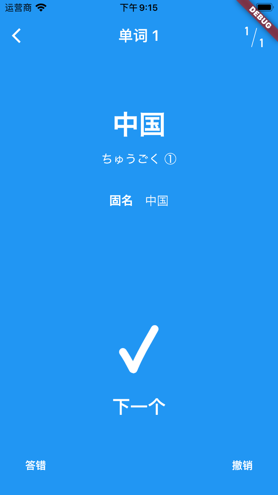

# Tango Helper

A Flutter application used to help memorize Japanese words, especially their pronunciations and written forms. Unlike many apps related to word memorization, this app does not provide daily tasks. You should use your own word list, and everything will be based on that. You could see how many times you have encountered a specific word, as well as how many times you clicked the "Remember" button. That data is provided for you, but currently, the app does not make changes to the frequency you encounter each word. (The default random function in Dart is used now.)

## Features

The unchecked items have not been implemented yet.

- [x] Custom word list
  - [x] Written form
  - [ ] Alternative written forms
  - [x] Hiragana
  - [x] Accent
  - [x] Part of speech
  - [x] Meaning
  - [ ] Example sentences
  - [x] Brief memorization history
  - [ ] Detailed memorization history
- [x] Word memorization
  - [x] "Remember"/"Don't remember" options
  - [ ] Multiple choice questions
  - [x] Read test (written form to hiragana)
  - [x] Meaning test (written form/hiragana to meaning)
  - [ ] Output test (meaning to written form/hiragana)
  - [x] Write test (hiragana to written form)
  - [x] Accent support
  - [ ] Hints
  - [x] Test mode selection
- [ ] Platform collaboration
  - [ ] Word list import/export
  - [ ] Back end
- [ ] User-friendly UI

## Installation

This app is still in the alpha stage, and we do not provide pre-compiled binaries. You can visit the [Flutter website](https://flutter.dev) and read the instructions on how to build the app.

Considering the repo size and potential copyright issues, we do not provide font files in the repository. A Japanese font (Noto Serif JP) is specified in `pubspec.yaml`. You can download the files on [Google Fonts](https://fonts.google.com) and copy them into `fonts/` directory if you would like to used the font. Otherwise, you could modify `pubspec.yaml` or other source files to use other fonts. A Chinese font should also be specified in `pubspec.yaml`, with the name *ChineseFont*. You can copy your favorite Chinese font into `fonts/`, and specify it as *ChineseFont* in `pubspec.yaml`. This font is used in word explanations.

## Screenshots

# Acknowledgments

The major functionalities of this app are inspired by other word-memorizing apps, such as MOJi辞書, 沪江开心词场, 拓词 (for English), and 扇贝单词 (for English). Parts of speeches are based on the grammar system of the Japanese textbook *综合日语*.