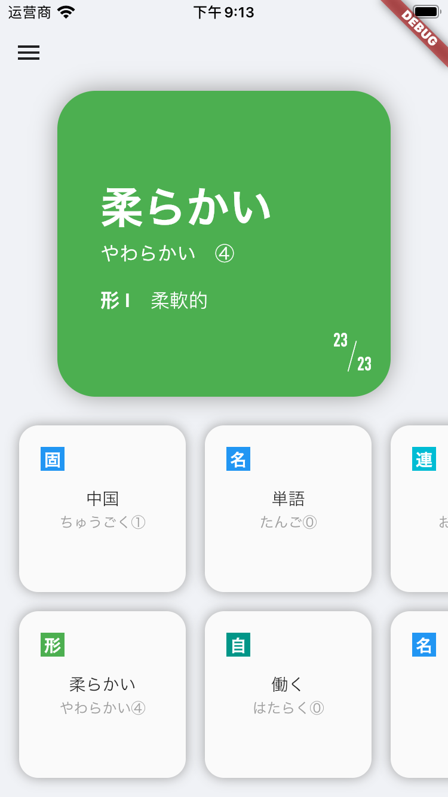
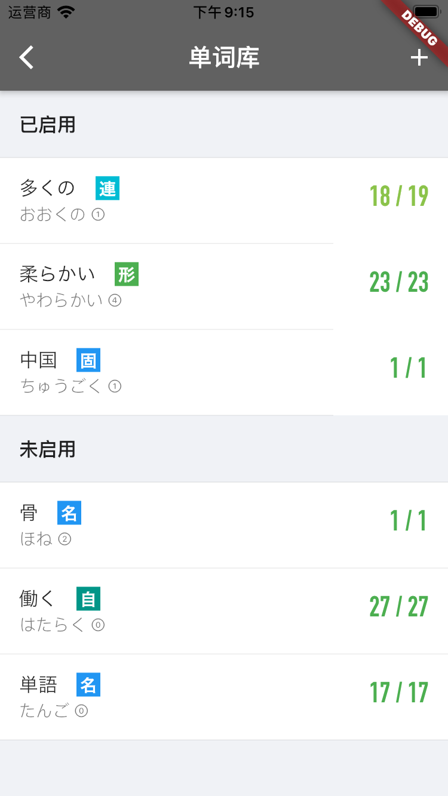
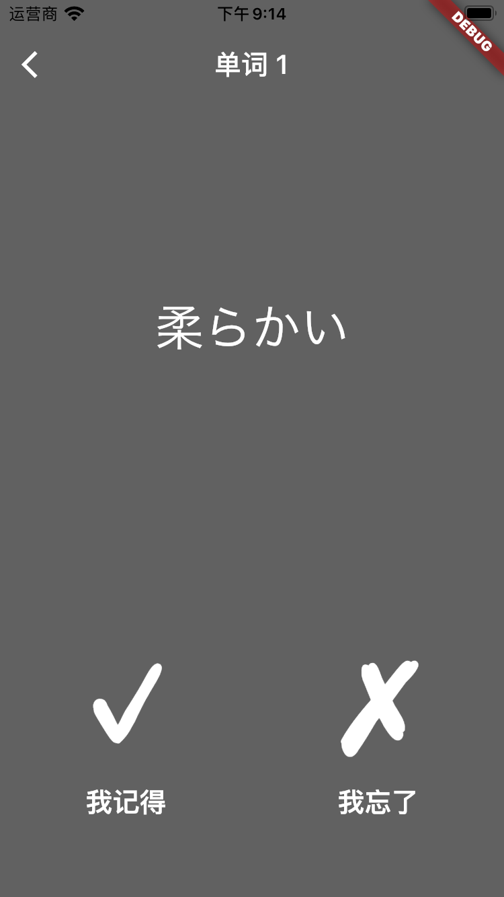

# Tango Helper

A Flutter application used to help memorize Japanese words, especially their pronunciations and written forms. Unlike many apps related to word memorization, this app does not provide daily tasks. You should use your own word list, and everything will be based on that. You could see how many times you have encountered a specific word, as well as how many times you clicked the "Remember" button. That data is provided for you, but currently, the app does not make changes to the frequency you encounter each word. (The default random function in Dart is used now.)

## Features

The unchecked items have not been implemented yet.

- [x] Custom word list
  - [x] Written form
  - [ ] Alternative written forms
  - [x] Hiragana
  - [x] Accent
  - [x] Part of speech
  - [x] Meaning
  - [ ] Example sentences
  - [x] Brief memorization history
  - [x] Detailed memorization history
- [x] Word memorization
  - [x] "Remember"/"Don't remember" options
  - [ ] Multiple choice questions
  - [x] Read test (written form to hiragana)
  - [x] Meaning test (written form/hiragana to meaning)
  - [x] Output test (meaning to written form/hiragana)
  - [x] Write test (hiragana to written form)
  - [x] Accent support
  - [ ] Word form support
  - [ ] Explanation separation support
  - [ ] Hints
  - [x] Test mode selection
- [ ] Platform collaboration
  - [ ] Word list import/export
  - [ ] Back end
- [ ] User-friendly UI

## Installation

This app is still in the alpha stage, and we do not provide pre-compiled binaries. You can visit the [Flutter website](https://flutter.dev) and read the instructions on how to build the app.

We used two external fonts for Chinese and Japanese in the legacy UI version. Considering the repo size and potential copyright issues, we do not provide font files in the repository. In the current UI version, we used the Flutter package `google_fonts` to eliminate the need of downloading the fonts manually. Also, we are now using the fonts shipped with iOS for most cases. You can substitute them with your favorite fonts when needed.

## Screenshots

# Acknowledgments

The major functionalities of this app are inspired by other word-memorizing apps, such as MOJi辞書, 沪江开心词场, 拓词 (for English), and 扇贝单词 (for English). Parts of speech are based on the grammar system of the Japanese textbook *综合日语*. The idea assigning a color to each part of speech is from the app MOJi辞書. The color scheme of scores is inspired by the color scheme of PKU Helper.